# Smart Employee Hub

> [!NOTE] > **📱 Android & iOS Only** - This application is designed exclusively for mobile platforms.

A comprehensive employee management system built with Flutter, providing a streamlined solution for HR operations, attendance tracking, leave management, payroll processing, and internal communications.

## 📱 About

Smart Employee Hub is a feature-rich mobile application designed to streamline HR and employee management operations. Leveraging Flutter's cross-platform capabilities and GetX for robust state management, this application delivers an intuitive and responsive interface for employees to efficiently manage their daily work activities, including attendance tracking, leave applications, payroll access, team directory, and internal communications.

This application serves as a proof-of-concept demonstrating modern mobile development practices, featuring a complete UI/UX implementation with simulated data flows. It showcases the potential of Flutter-based enterprise applications while maintaining a focus on user experience and code quality.

## ✨ Features

### 🔐 Authentication

-   Employee ID/Email and password login
-   Biometric authentication (Fingerprint/Face ID)

### 🏠 Dashboard

-   Personalized greetings with employee name
-   Casual leave balance overview with visual indicators
-   Quick access shortcuts (Directory, Payslip, Attendance)
-   Upcoming events and tasks timeline
-   My tasks with priority indicators
-   System notifications and alerts
-   Pending approvals tracking

### 📅 Attendance Management

-   Daily attendance tracking
-   Monthly attendance overview
-   Real-time status indicators (Present, Late, Absent)
-   Historical attendance records
-   Location-based check-in visualization

### 🏖️ Leave Management

-   Multi-step leave application process
-   Three leave types: Casual, Sick, Emergency
-   Date range selection with calendar picker
-   Leave reason and description
-   Task handover to colleagues
-   Manager approval workflow
-   Leave balance tracking
-   Confirmation notifications

### 💰 Payroll System

-   Monthly salary slips
-   Detailed earnings breakdown:
    -   Basic Salary
    -   House Rent Allowance
    -   Medical Allowance
    -   Conveyance
-   Deductions display:
    -   Tax (TDS)
    -   Provident Fund
-   Net pay calculation
-   Month-wise navigation
-   PDF generation and sharing
-   Download payslip functionality

### 👥 Staff Directory

-   Complete employee directory
-   Department-wise filtering (Engineering, Design, Marketing, HR)
-   Search functionality
-   Employee contact details
-   Direct call, email, and chat options
-   Employee profile viewing
-   Organizational hierarchy

### 🔔 Notifications

-   Dual notification system:
    -   My Alerts (personal notifications)
    -   Notice Board (company-wide announcements)
-   Categorized notifications:
    -   Critical alerts (server maintenance, system updates)
    -   HR policy updates
    -   Event notifications with attachments
    -   Leave approvals/rejections
    -   Login attempt tracking
-   Real-time notification badges

### 🤖 AI Assistant

-   Smart HR policy assistant powered by Google's Gemini AI
-   Natural language query processing for HR policies
-   Context-aware responses grounded in company guidelines
-   Real-time conversational chat interface
-   Instant answers to HR-related inquiries
-   Intelligent policy search and information retrieval

### 💬 Messaging

-   Chat inbox with conversation list
-   Unread message indicators
-   Individual chat details screen
-   Message timestamps and read status
-   File attachment display (PDF, documents)
-   User avatar and online status
-   Search and filter conversations

### 👤 Profile Management

-   Comprehensive personal information display
-   Professional details:
    -   Department and designation
    -   Reporting manager
    -   Office desk location
    -   Employee ID and joining date
-   Contact information (phone, email)
-   Profile photo and cover image customization
-   Edit profile capabilities
-   User preferences and settings

### 📚 Resources & Learning

-   Comprehensive training course catalog
-   Real-time course progress tracking
-   Video lectures and learning materials
-   Centralized document library:
    -   Employee Handbook
    -   Insurance Policy
    -   Technical Documentation
    -   Standard Operating Procedures
-   Categorized resource organization
-   Course enrollment management
-   Digital certificate generation
-   Instructor profiles and credentials

## 🎨 UI Screenshots

### Authentication & Dashboard

<p align="center">
  
  
  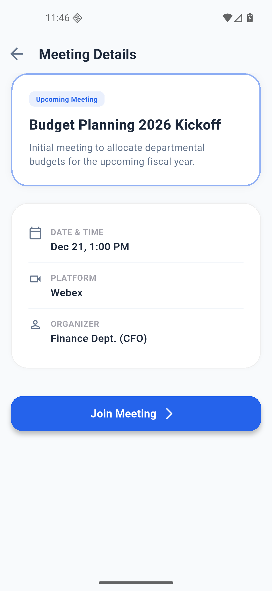
</p>

<p align="center">
  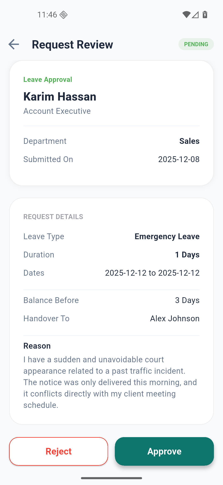
  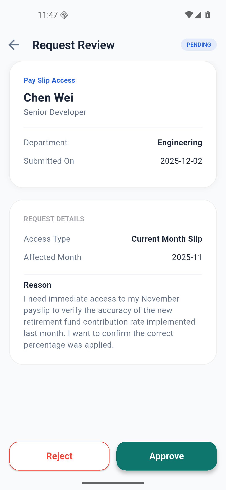
  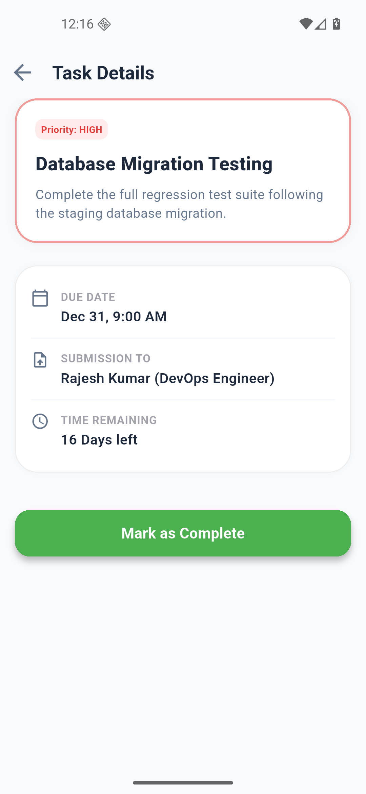
</p>

### Attendance & Leave Management

<p align="center">
  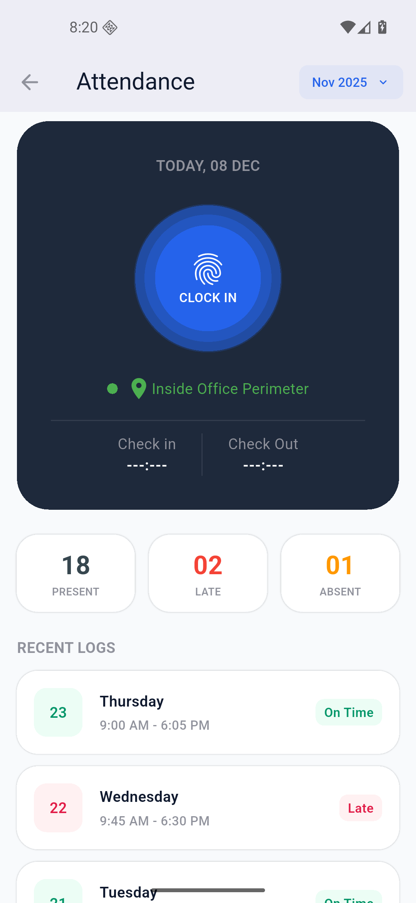
  
  
</p>

<p align="center">
  
  
  
</p>

### Communication & Notifications

<p align="center">
  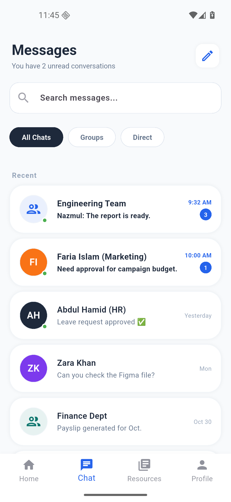
  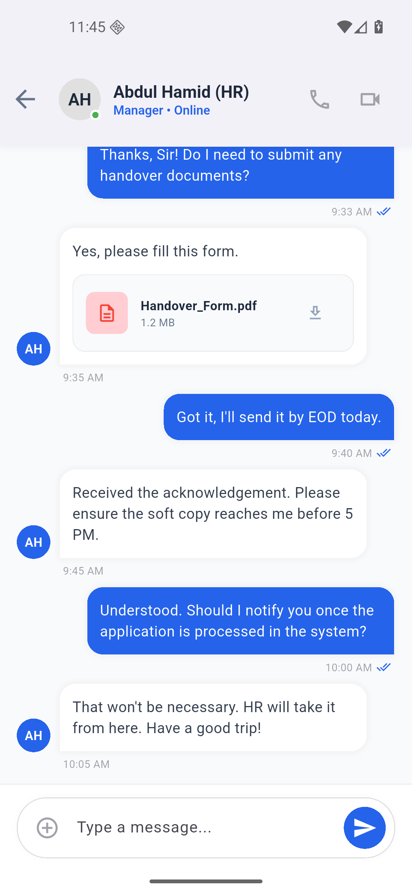
  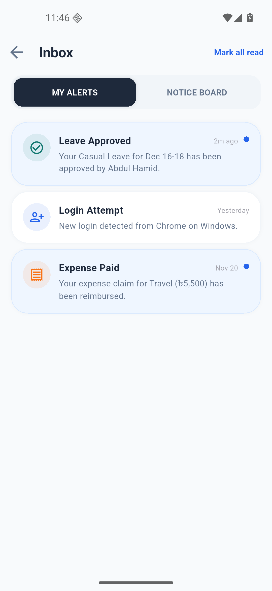
</p>

<p align="center">
  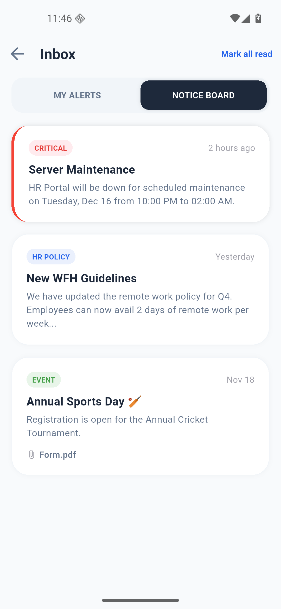
  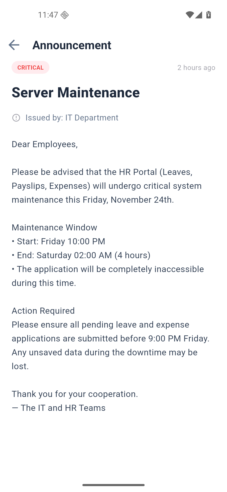
  
</p>

### Employee Directory & Payroll

<p align="center">
  
  
  
</p>

### Profile & Resources

<p align="center">
  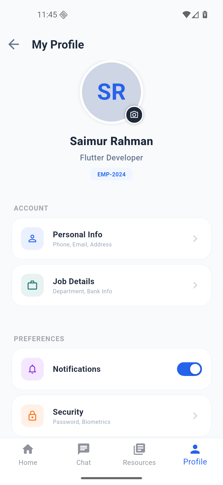
  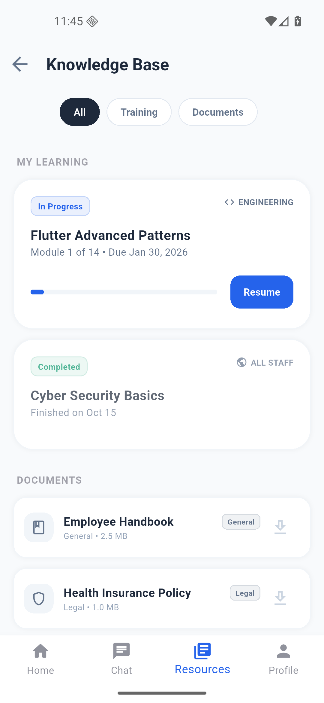
  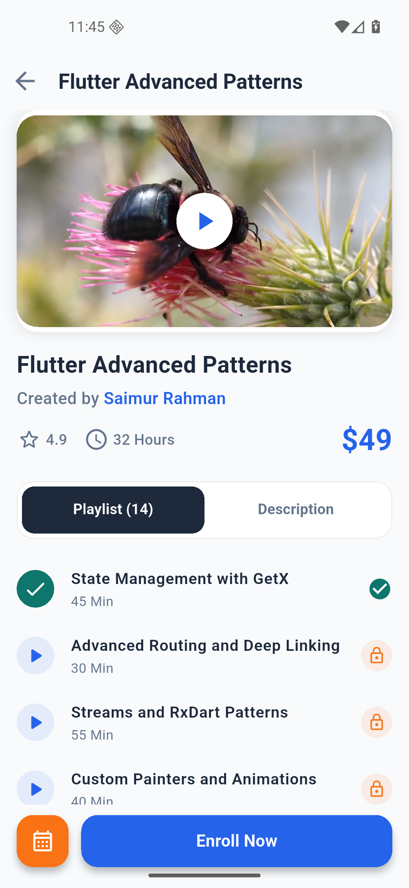
</p>

## 🛠️ Technologies & Architecture

### Core Technologies

-   **Framework:** Flutter 3.x
-   **Language:** Dart
-   **State Management:** GetX
-   **Platform:** Android & iOS

### Key Dependencies

```yaml
dependencies:
    get: ^4.6.6 # State management & routing
    flutter_svg: ^2.0.10+1 # SVG rendering
    pdf: ^3.11.1 # PDF generation
    printing: ^5.13.2 # PDF sharing
    path_provider: ^2.1.4 # File system access
```

### Architecture

-   **Pattern:** MVC with GetX
-   **State Management:** Reactive GetX controllers
-   **Navigation:** GetX routing
-   **UI Components:** Modular and reusable widgets

## 📂 Project Structure

```
smart_employee_management/
├── lib/
│   ├── main.dart                           # App entry point
│   │
│   ├── controllers/                        # GetX Controllers
│   │   ├── login_controller.dart           # Login state management
│   │   ├── bottom_navigation_bar_controller.dart
│   │   ├── dashboard_task_tab_controller.dart
│   │   ├── leave_application_controller.dart
│   │   ├── payslip_controller.dart
│   │   ├── attendance_controller.dart
│   │   ├── gemini_controller.dart          # AI Assistant controller
│   │   ├── chat_inbox_controller.dart      # Messaging controller
│   │   ├── notification_controller.dart    # Notifications controller
│   │   ├── staff_directory_controller.dart # Staff directory controller
│   │   ├── my_profile_controller.dart      # Profile controller
│   │   └── resources_controller.dart       # Learning resources controller
│   │
│   ├── views/                              # UI Screens
│   │   ├── LoginScreen/
│   │   │   └── login_screen.dart
│   │   ├── HomeScreen/
│   │   │   ├── home_screen.dart
│   │   │   └── widgets/
│   │   │       ├── casual_balance_card.dart
│   │   │       ├── dashboard_quick_access.dart
│   │   │       ├── grettings_and_notification.dart
│   │   │       ├── pending_approvals.dart
│   │   │       ├── tab_button.dart
│   │   │       ├── timeline_items_due_task.dart
│   │   │       └── timeline_items_meeting.dart
│   │   ├── AttendanceScreen/
│   │   │   └── attendance_screen.dart
│   │   ├── LeaveApplication/
│   │   │   ├── leave_application_step_one.dart
│   │   │   ├── leave_application_step_two.dart
│   │   │   └── leave_application_step_three.dart
│   │   ├── PayslipScreen/
│   │   │   └── payslip_screen.dart
│   │   ├── StaffDirectory/
│   │   │   └── staff_directory_screen.dart
│   │   ├── SingleStaffProfile/
│   │   │   └── single_staff_profile_screen.dart
│   │   ├── ChatInboxScreen/                # Messaging
│   │   │   └── chat_inbox_screen.dart
│   │   ├── ChatDetailsScreen/
│   │   │   └── chat_details_screen.dart
│   │   ├── NotificationScreen/
│   │   │   └── notification_screen.dart
│   │   ├── NotificationDetailScreen/
│   │   │   └── notification_detail_screen.dart
│   │   ├── MyProfile/
│   │   │   └── my_profile_screen.dart
│   │   ├── Resources/                      # Learning & Training
│   │   │   └── resources_screen.dart
│   │   ├── CourseDetailsScreen/
│   │   │   └── course_details_screen.dart
│   │   ├── AIAssistantScreen/              # AI Assistant
│   │   │   ├── ai_assistant_screen.dart
│   │   │   └── widgets/
│   │   │       ├── chat_bubble.dart
│   │   │       └── gemini_services.dart    # Gemini API integration
│   │   └── NavBarView/
│   │       └── nav_bar_view.dart           # Bottom navigation
│   │
│   ├── widgets/                            # Global Widgets
│   │   └── custom_button.dart
│   │
│   └── utils/                              # Utilities
│       ├── colors.dart                     # App color scheme
│       └── pdf_generator.dart              # PDF generation utility
│
├── assets/
│   └── svg/                                # SVG assets
│
├── screenshot_of_ui/                       # App screenshots
│
├── .env                                    # Environment variables (not tracked)
├── .env.example                            # Environment template
│
├── android/                                # Android configuration
├── ios/                                    # iOS configuration
│
├── pubspec.yaml                            # Dependencies
└── README.md
```

## 🚀 Getting Started

### Prerequisites

-   Flutter SDK 3.0 or higher
-   Dart SDK 3.0 or higher
-   Android Studio / VS Code
-   Android SDK (for Android development)
-   Xcode (for iOS development - macOS only)

### Installation

1. **Clone the repository**

    ```bash
    git clone https://github.com/newbie-saimur/smart-employee-management-app-flutter.git
    cd smart-employee-management-app-flutter
    ```

2. **Install dependencies**

    ```bash
    flutter pub get
    ```

3. **Set up environment variables**

    Create a `.env` file in the root directory and add your Gemini API key:

    ```bash
    # Copy the example file
    cp .env.example .env
    ```

    Edit `.env` and add your actual API key:

    ```env
    GEMINI_API_KEY=your_actual_gemini_api_key_here
    ```

    > **🔑 Get Gemini API Key:** Visit [Google AI Studio](https://makersuite.google.com/app/apikey) to get your free API key

4. **Run the app**

    ```bash
    flutter run
    ```

### Build APK/IPA

```bash
# Android APK
flutter build apk --release

# Android App Bundle
flutter build appbundle --release

# iOS (macOS only)
flutter build ios --release
```

### 📥 Download Release APK

For quick testing on Android devices, download the pre-built APK:

**[Download smart-employee-management.apk](release/smart-employee-management.apk)** (~54 MB)

> **⚠️ Important:** This is a comprehensive UI/UX demonstration showcasing frontend design and user interface implementation. The application currently operates with simulated data and does not include backend database connectivity. Features such as authentication, data persistence, and real-time synchronization are represented through mock data flows. Refer to the [Pending Features](#-pending-features) section for planned backend integrations.
>
> **Installation Note:** To install this APK, you may need to enable "Install from Unknown Sources" or "Allow from this source" in your Android device security settings.

## 🎯 Implementation Status

### ✅ Completed Features

-   [x] Login screen with validation
-   [x] Biometric authentication UI
-   [x] Bottom navigation with 4 tabs
-   [x] Dashboard with leave balance card
-   [x] Quick access shortcuts
-   [x] Timeline/Task tabs with dynamic switching
-   [x] Attendance screen UI
-   [x] 3-step leave application flow
-   [x] Date picker integration
-   [x] Payslip screen with month navigation
-   [x] PDF generation and sharing for payslips
-   [x] Staff directory with filtering
-   [x] Notification center (Alerts & Notice Board)
-   [x] Chat screens UI
-   [x] Profile screen
-   [x] Knowledge base UI
-   [x] Biometric authentication functionality
-   [x] Responsive design for multiple screen sizes
-   [x] GetX state management integration
-   [x] Custom reusable widgets
-   [x] Search functionality implementation

### 🚧 Pending Features

#### Backend & Infrastructure

-   [ ] Backend API integration
-   [ ] Firebase integration (Authentication, Firestore, Cloud Storage)
-   [ ] Real authentication system
-   [ ] Database integration
-   [ ] Push notifications
-   [ ] Real-time messaging

#### Administrative Features

-   [ ] Company about page
-   [ ] Add new employee into system
-   [ ] Add/edit employee management
-   [ ] Add/edit notices and announcements
-   [ ] Add/edit resources and training materials
-   [ ] View leave history (admin panel)
-   [ ] Expense approval workflow

#### User Features

-   [ ] Settings and preferences
-   [ ] Light/Dark theme toggle
-   [ ] Add due tasks functionality
-   [ ] Meeting schedule management
-   [ ] Expense submission
-   [ ] Expense history and tracking
-   [ ] File upload functionality
-   [ ] Location-based attendance tracking

#### Calendar & Scheduling

-   [ ] Monthly attendance calendar view
-   [ ] Corporate event calendar
-   [ ] Meeting reminders and notifications

## 🎓 Academic Project

This project was developed as part of a Mobile Application Design course to demonstrate proficiency in:

-   **Modern Flutter Development:** Implementing cross-platform mobile applications using industry-standard practices
-   **State Management:** Utilizing GetX for efficient reactive state management and dependency injection
-   **Responsive UI/UX Design:** Creating adaptive interfaces that work across different screen sizes and orientations
-   **Document Processing:** Implementing PDF generation and file handling capabilities
-   **Navigation Patterns:** Implementing complex routing and navigation flows
-   **Component Architecture:** Developing reusable, modular widget components
-   **Code Quality:** Maintaining clean, maintainable, and well-documented code architecture
-   **API Integration:** Demonstrating integration with external services (Gemini AI)
-   **Security Best Practices:** Implementing environment variable management for sensitive data

## 👥 Contributors

**Md Saimur Rahman Robin** - Lead Developer

-   GitHub: [@newbie-saimur](https://github.com/newbie-saimur)
-   Role: Architecture Design, Full-stack Development, Documentation

**Farhana Ali** - Co-Developer

-   GitHub: [@ali-farhana](https://github.com/ali-farhana)
-   Role: UI/UX Co-Designer, Frontend Development

**Eyamin Hossain** - Team Member

-   GitHub: [@eyamin-hossain](https://github.com/hossainy068-dot)
-   Role: Project Observer, Documentation Review

---

**Project Repository: [smart-employee-management-app-flutter](https://github.com/newbie-saimur/smart-employee-management-app-flutter)**

_Last Updated: December 2025_
