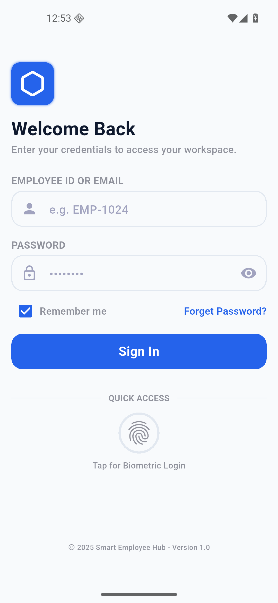
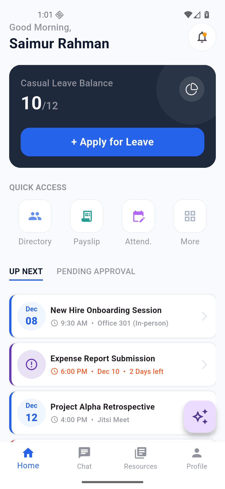
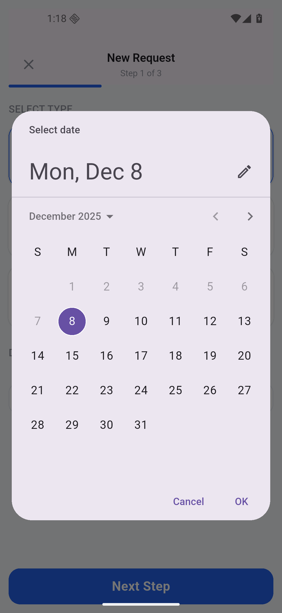
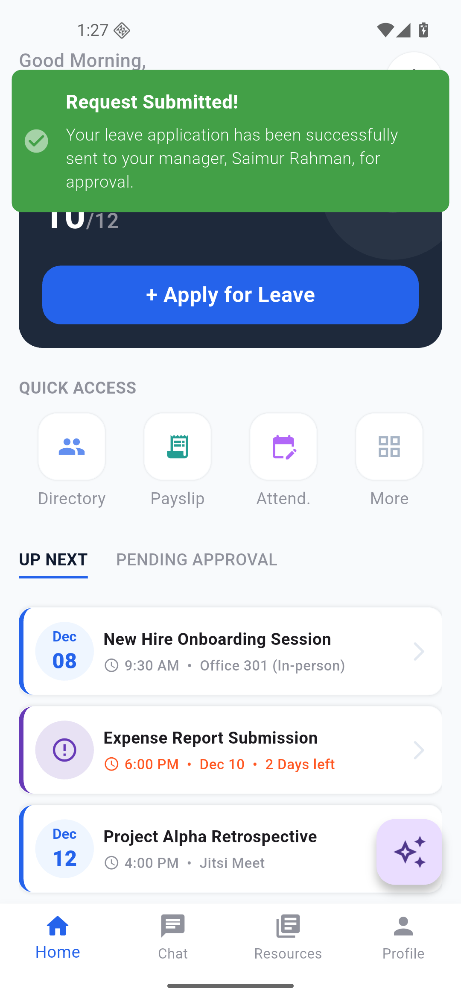
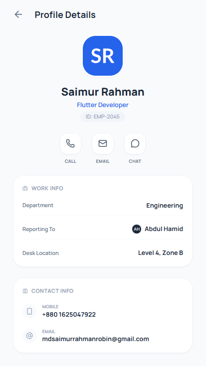
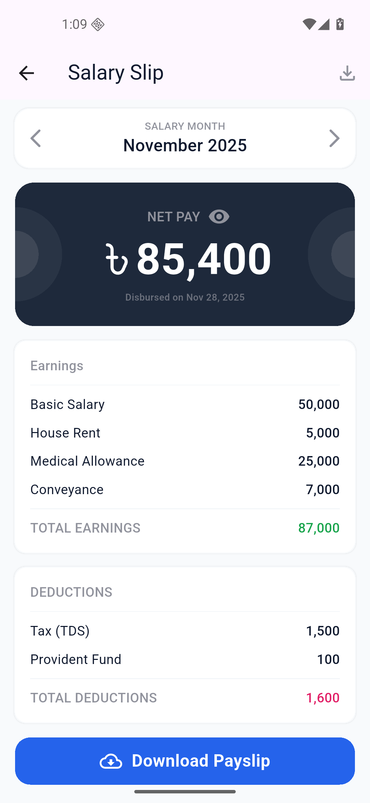

# Smart Employee Management

> [!WARNING] > **🚧 UNDER DEVELOPMENT** - This project is currently being developed as part of my academic lab project for the Mobile Application Design course. The complete source code will be uploaded after the final evaluation of the lab project.

> [!IMPORTANT] > **📱 MOBILE ONLY** - This application is designed and optimized exclusively for **Android and iOS mobile devices**. Desktop and web platforms are not supported.

A comprehensive employee management system built with Flutter as part of my Mobile Application Design course lab project.

## 📱 About

This application provides a complete solution for managing employee-related tasks including attendance tracking, leave management, messaging, payroll, and more. The app features a modern, intuitive UI with biometric authentication support and is fully responsive across different mobile screen sizes.

## ✨ Features

-   **Authentication**

    -   Secure login with Employee ID/Email and Password
    -   Biometric authentication (Face ID/Fingerprint)
    -   Remember me functionality

-   **Dashboard**

    -   Personalized greeting with user name
    -   Leave balance overview
    -   Quick access to key features (Directory, Payslip, Attendance, More)
    -   Upcoming tasks and events
    -   System notifications and alerts

-   **Attendance Management**

    -   Biometric clock-in/clock-out
    -   Location-based perimeter tracking
    -   Real-time attendance status (Present, Late, Absent)
    -   Historical attendance logs
    -   Monthly attendance overview

-   **Leave Management**

    -   Multiple leave types (Casual, Sick, Emergency)
    -   Multi-step leave request process
    -   Leave balance tracking
    -   Reason and handover task specification
    -   Approval workflow with manager assignment

-   **Messaging System**

    -   Group and direct messaging
    -   Unread conversation notifications
    -   File attachments support (PDF, etc.)
    -   Message search functionality
    -   Pinned conversations

-   **Payroll**

    -   Detailed salary slips with PDF generation
    -   Earnings breakdown (Basic Salary, House Rent, Medical Allowance, Conveyance)
    -   Deductions display (Tax, Provident Fund)
    -   Monthly net pay calculation
    -   Downloadable/Shareable payslips in PDF format
    -   Month-wise navigation for historical payslips

-   **Staff Directory**

    -   Searchable employee list
    -   Department-wise filtering (Engineering, Design, Marketing, HR)
    -   Contact information (Call, Email, Chat)
    -   Employee role and details

-   **Notifications**

    -   My Alerts and Notice Board
    -   Critical alerts (Server Maintenance, etc.)
    -   HR policy updates
    -   Event notifications with attachments
    -   Leave approval notifications
    -   Login attempt tracking

-   **Profile Management**

    -   Personal information
    -   Job details (Department, Reporting Manager, Desk Location)
    -   Contact information
    -   Security settings (Password, Biometrics)
    -   App preferences

-   **Knowledge Base**
    -   Training modules with progress tracking
    -   Document library (Employee Handbook, Insurance Policy, API Documentation)
    -   Category-based document organization
    -   Resume functionality for ongoing training

## 🎨 UI Screenshots

> [!NOTE]
> The Flutter implementation is completed with fully functional features including state management, responsive design, and PDF generation capabilities.

### Authentication & Dashboard

<p align="center">
  
  
</p>

### Attendance & Leave Management

<p align="center">
  
  
  
</p>

<p align="center">
  
  
  
</p>

### Communication & Notifications

<p align="center">
  
  
  
</p>

<p align="center">
  
</p>

### Employee Directory & Payroll

<p align="center">
  
  
  
</p>

### Profile & Resources

<p align="center">
  
  
</p>

## 🛠️ Technologies Used

-   **Framework:** Flutter 3.x
-   **Language:** Dart
-   **State Management:** GetX
-   **Platform Support:** Android & iOS (Mobile Only)
-   **Key Packages:**
    -   `flutter_screenutil` - Responsive UI
    -   `get` - State management and navigation
    -   `flutter_svg` - SVG asset rendering
    -   `pdf` - PDF document generation
    -   `printing` - PDF sharing and printing
    -   `path_provider` - File system access
    -   `device_preview` - Multi-device testing

## 📂 Project Structure

```
lib/
  ├── main.dart                 # Application entry point
  ├── controllers/              # GetX controllers for state management
  │   ├── login_controller.dart
  │   ├── bottom_navigation_bar_controller.dart
  │   ├── dashboard_task_tab_controller.dart
  │   └── payslip_controller.dart
  ├── views/                    # UI screens
  │   ├── LoginScreen/
  │   ├── HomeScreen/
  │   ├── PaySlipScreen/
  │   ├── NavBarView/
  │   └── widgets/              # Reusable UI components
  ├── utils/                    # Utility classes
  │   ├── colors.dart
  │   ├── responsive_helper.dart
  │   └── pdf_generator.dart
  └── widgets/                  # Global widgets
      └── custom_button.dart
screenshot_of_ui/               # UI design screenshots
```

## 🚀 Getting Started

### Prerequisites

-   Flutter SDK (3.0 or higher)
-   Dart SDK
-   Android Studio / Xcode for mobile development
-   Android device/emulator or iOS device/simulator

### Installation

1. Clone the repository

```bash
git clone https://github.com/newbie-saimur/smart-employee-management-app-flutter.git
cd smart-employee-management-app-flutter
```

2. Install dependencies

```bash
flutter pub get
```

3. Run the app

```bash
flutter run
```

## ✨ Key Features Implemented

✅ Responsive UI design for all mobile screen sizes
✅ GetX state management for reactive UI updates
✅ PDF generation and sharing for payslips
✅ Tab navigation with persistent state
✅ Custom reusable widgets
✅ SVG asset support
✅ Device preview for testing multiple screen sizes
✅ Clean architecture with separation of concerns

## 🎓 About This Project

This project was developed as part of a Mobile Application Design course to demonstrate modern Flutter development practices, state management with GetX, responsive design principles, and mobile-first UI/UX implementation.

### Development Status

-   ✅ UI Implementation Complete
-   ✅ State Management Integrated
-   ✅ Responsive Design Implemented
-   ✅ PDF Generation Feature Added
-   🚧 Backend Integration (Pending)
-   🚧 Real-time Features (Pending)

---

_Last Updated: December 2025_
