# Smart Employee Management

> [!WARNING] > **🚧 UNDER DEVELOPMENT** - This project is currently being developed as part of my academic lab project for the Mobile Application Design course. The complete source code will be uploaded after the final evaluation of the lab project.

A comprehensive employee management system built with Flutter as part of my Mobile Application Design course lab project.

## 📱 About

This application provides a complete solution for managing employee-related tasks including attendance tracking, leave management, messaging, payroll, and more. The app features a modern, intuitive UI with biometric authentication support.

## ✨ Features

-   **Authentication**

    -   Secure login with Employee ID/Email and Password
    -   Biometric authentication (Face ID/Fingerprint)
    -   Remember me functionality

-   **Dashboard**

    -   Personalized greeting with user name
    -   Leave balance overview
    -   Quick access to key features (Directory, Payslip, Attendance, More)
    -   Upcoming tasks and events
    -   System notifications and alerts

-   **Attendance Management**

    -   Biometric clock-in/clock-out
    -   Location-based perimeter tracking
    -   Real-time attendance status (Present, Late, Absent)
    -   Historical attendance logs
    -   Monthly attendance overview

-   **Leave Management**

    -   Multiple leave types (Casual, Sick, Emergency)
    -   Multi-step leave request process
    -   Leave balance tracking
    -   Reason and handover task specification
    -   Approval workflow with manager assignment

-   **Messaging System**

    -   Group and direct messaging
    -   Unread conversation notifications
    -   File attachments support (PDF, etc.)
    -   Message search functionality
    -   Pinned conversations

-   **Payroll**

    -   Detailed salary slips
    -   Earnings breakdown (Basic Salary, House Rent, Medical Allowance, Conveyance)
    -   Deductions display (Tax, Provident Fund)
    -   Monthly net pay calculation
    -   Downloadable payslips

-   **Staff Directory**

    -   Searchable employee list
    -   Department-wise filtering (Engineering, Design, Marketing, HR)
    -   Contact information (Call, Email, Chat)
    -   Employee role and details

-   **Notifications**

    -   My Alerts and Notice Board
    -   Critical alerts (Server Maintenance, etc.)
    -   HR policy updates
    -   Event notifications with attachments
    -   Leave approval notifications
    -   Login attempt tracking

-   **Profile Management**

    -   Personal information
    -   Job details (Department, Reporting Manager, Desk Location)
    -   Contact information
    -   Security settings (Password, Biometrics)
    -   App preferences

-   **Knowledge Base**
    -   Training modules with progress tracking
    -   Document library (Employee Handbook, Insurance Policy, API Documentation)
    -   Category-based document organization
    -   Resume functionality for ongoing training

## 🎨 UI Screenshots

> [!NOTE]
> These are mock design concepts showing the intended UI/UX. The Flutter implementation is currently in progress.

### Authentication & Dashboard

<p align="center">
  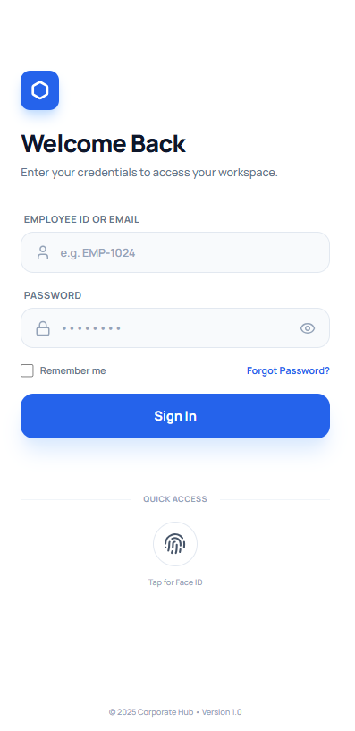
  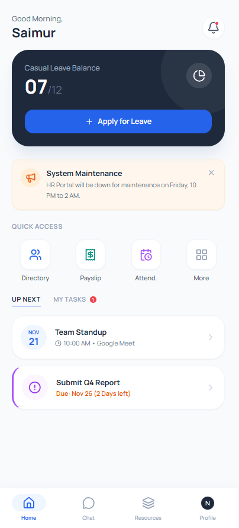
</p>

### Attendance & Leave Management

<p align="center">
  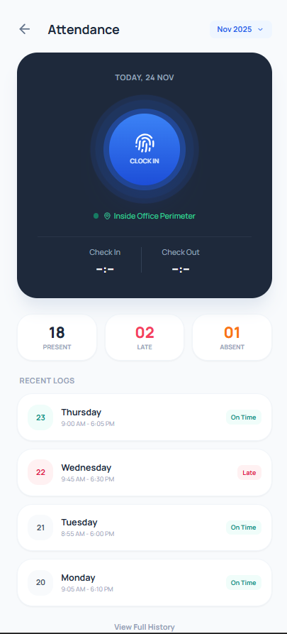
</p>

<p align="center">
  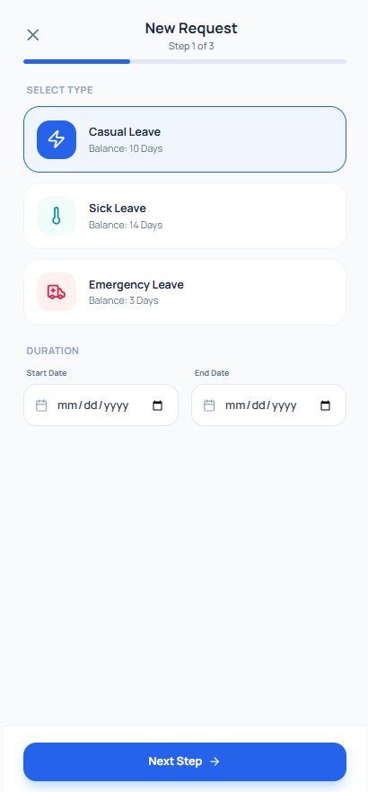
  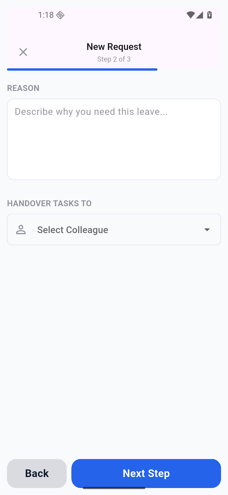
  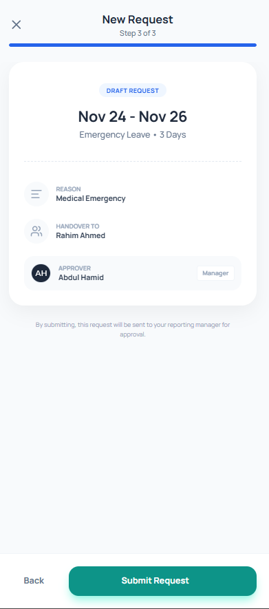
</p>

### Communication & Notifications

<p align="center">
  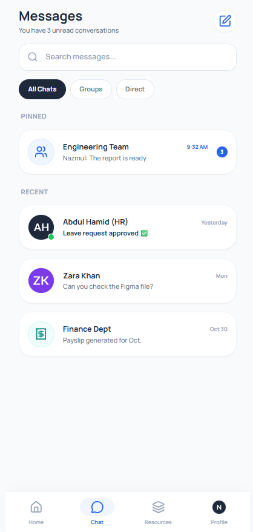
  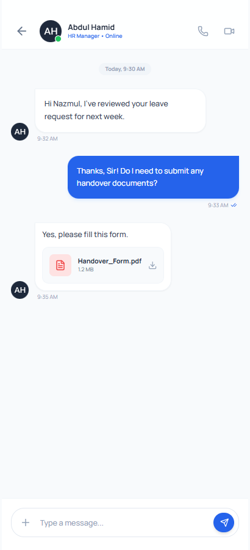
</p>

<p align="center">
  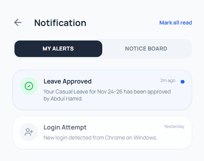
  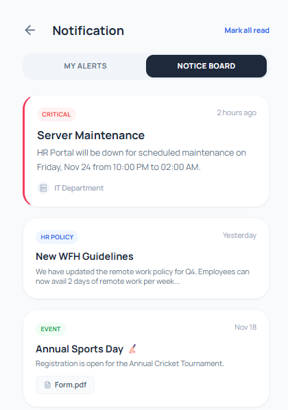
</p>

### Employee Directory & Payroll

<p align="center">
  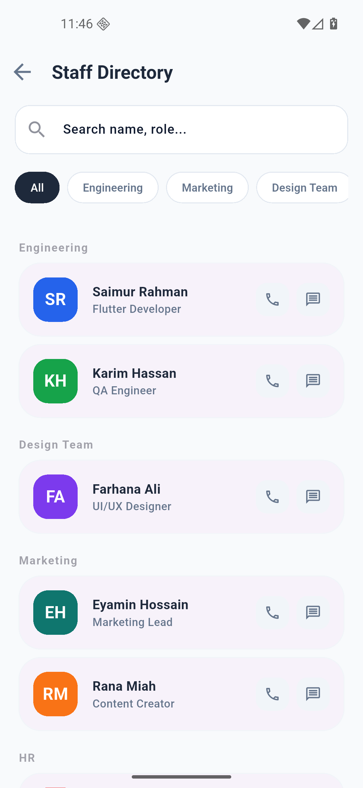
  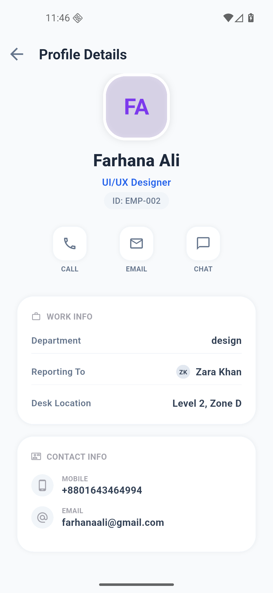
  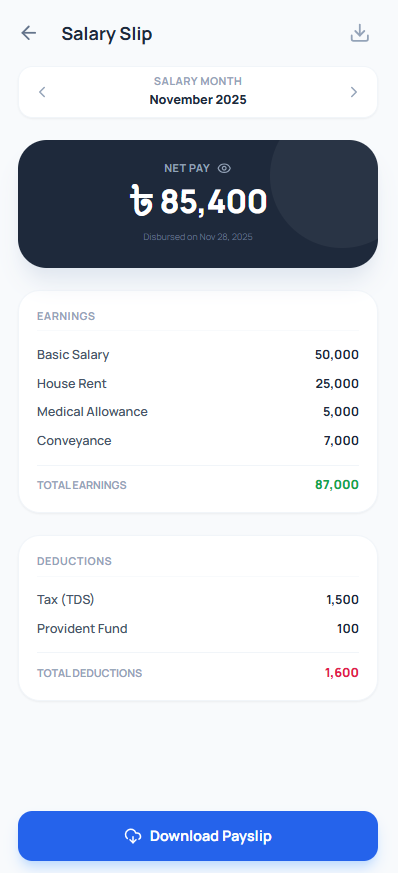
</p>

### Profile & Resources

<p align="center">
  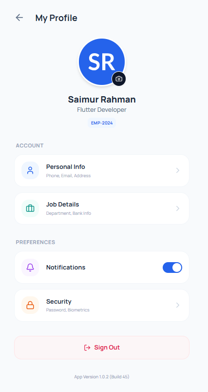
  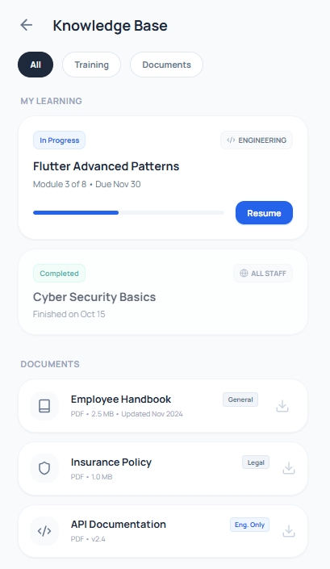
</p>

## 🛠️ Technologies Used

-   **Framework:** Flutter
-   **Language:** Dart
-   **Platform Support:** Android, iOS, Web, Windows, macOS, Linux

## 📂 Project Structure

```
lib/
  └── main.dart          # Application entry point
screenshot_of_ui/        # UI design screenshots
```

## 🎓 About This Project

This project was developed as part of a Mobile Application Design course to demonstrate modern Flutter development practices and UI/UX design principles.

---

_Last Updated: November 2025_
